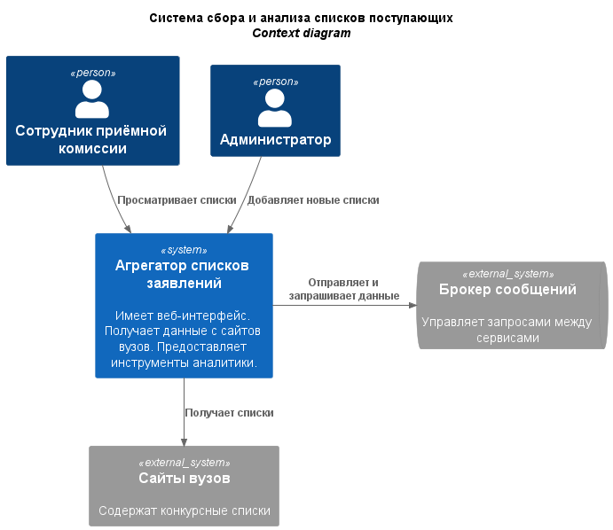
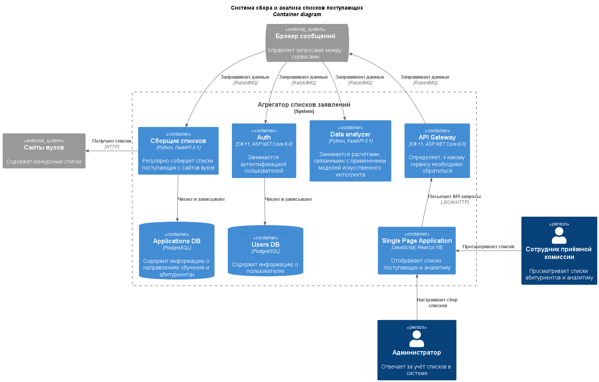
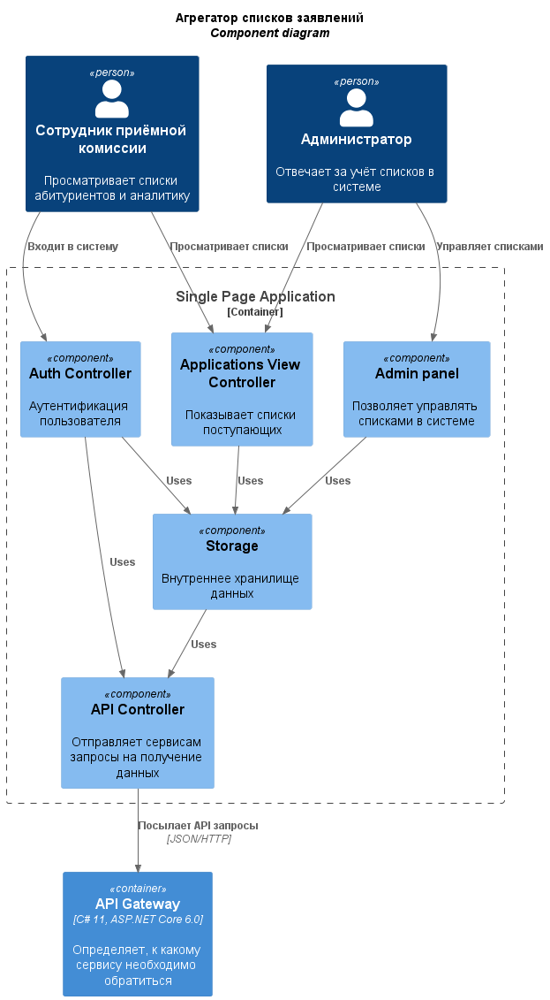
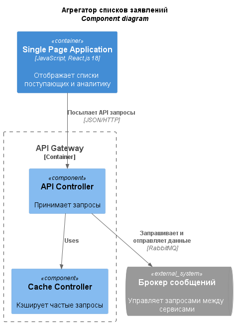
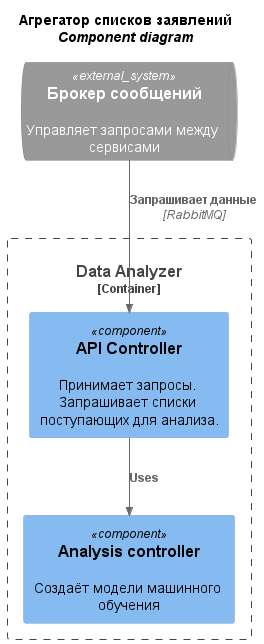
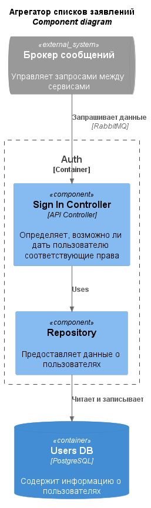
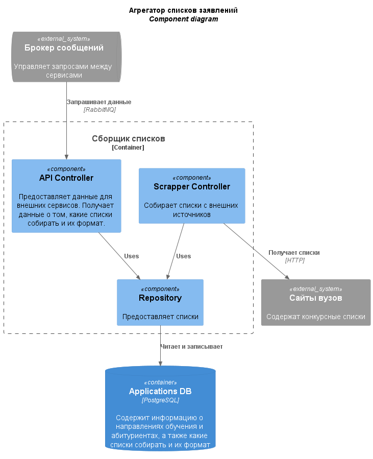

В качестве основного арихитектурного стиля была выбрана микросервисная архитектура, потому что у системы есть 3 основные функции - показ, сбор и анализ списков поступающих. Сбор и анализ являются ресурсозатратными операциями, поэтому будет целесообразно выделить под них отдельные вычислительные машины.

API Gateway проксирует вызовы к нужным микросервисам.

Брокер сообщений RabbitMQ позволит в будущем проще добавлять новые микросервисы, которые могут запрашивать данные от других сервисов, поскольку всё межсервисное взаимодействие происходит в одном месте.
К тому же, благодаря очереди сообщений, при сбое какого-либо микросервиса запросы к нему не будут потеряны.

# 1. Context diagram

# 2. Container diagram

# 3. Single Page Application component diagram

# 4. API Gateway component diagram

# 5. Data analyzer component diagram

# 6. Auth component diagram

# 7. Сборщик списков component diagram
