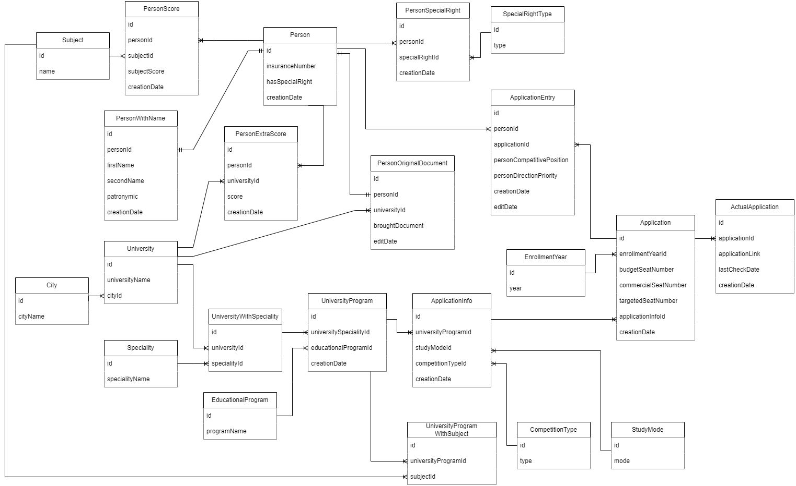

# Диаграмма компонентов
Реализован компонент Auth, который занимается созданием новых пользователей и получением данных о существующих пользователях.


# Диаграмма последовательностей


# Модель БД
В качестве СУБД выбрана PostgreSQL. <br/>
Схема базы данных для данного сервиса получилась бы всего из 2-х сущностей, поэтому привожу схему для бд в сервисе по сбору списков поступающих.


# О реализации
Используется фреймворк ASP.NET Core 6. Сам проект реализуется согласно чистой архитектуре. Имеется 4 проекта: <br/>
1. Domain (содержит основные сущности предметной области, не ссылается ни на кого).
2. Application (содержит операции над сущностями согласно бизнес-логике приложения, ссылается на Domain).
3. Persistence (использует фреймворк Entity Framework Core для работы с БД, ссылается на Domain и Application).
4. WebAPI (реализует основные эндпоинты, получает и записывает данные в БД, ссылается на все проекты).

# Основные принципы разработки
## 1. DRY
Проект Application. Есть две сущности: UserRole и User. Для каждой сущности реализованы Queries (например, GetAllUsersQuery и GetAllUserRolesQuery), каждому из которых требуется доступ к провайдеру данных. Поэтому решено вынести провайдер в базовый класс BaseQuery.
```
public abstract class BaseQuery<TDataProvider>
{
    protected readonly TDataProvider _dataProvider;

    protected BaseQuery(TDataProvider dataProvider)
    {
        _dataProvider = dataProvider;
    }
}

public class GetUserRoleQuery : BaseQuery<IUserRoleDataProvider>
{
    public GetUserRoleQuery(IUserRoleDataProvider dataProvider)
                : base(dataProvider)
    {
    }

    public async Task<UserRole> Query(Guid id)
    {
        return await _dataProvider.GetUserRoleAsync(id);
    }
}
```

## 2. KISS
Для каждой сущности в проекте Application реализованы собственные data-классы (CreateUserData и CreateUserRoleData), которые нужны для создания полноценной сущности из основной информации о ней. <br/>
Рекомендуется создавать подобные data-классы в проекте WebAPI, которые должны переводиться в data-классы проекта Application, так как на уровне Application для сущностей могут добавляться различные данные согласно бизнес-логике. Но в данном случае я этим пренебрегаю и использую data-классы напрямую из Application, так как в контексте работы с пользователями серьёзных изменений в бизнес-логике не предвидится.

## 3. YAGNI
Было решено не реализовывать функции по обновлению ролей пользователей, так как, вероятнее всего, в этом не будет необходимости.

## 4. SOLID
### 4.1. Single Responsibility
В проекте Application созданы отдельно для каждой сущности команды по их созданию (CreateUserCommand и CreateUserRoleCommand). Таким образом у каждого из этих классов будет одна причина для изменения кода (изменения в самих сущностях).
```
public class CreateUserRoleCommand : ICreateCommand<UserRole, CreateUserRoleData>
{
    public UserRole Create(CreateUserRoleData data)
    {
        return new UserRole()
        {
            Id = Guid.NewGuid(),
            RoleName = data.RoleName,
        };
    }
}
```

### 4.2. Open-closed
Если понадобится добавить какую-либо сущность, то для работы с ней понадобится создавать новые классы (CreateСущностьCommand, СущностьController, ...), а другие классы изменять не будет необходимости.

### 4.3. Liskov Substitution
В проекте Persistence класс UsersDbContext наследуется от DbContext, и к данному классу (UsersDbContext) можно обращаться так же, как к DbContext, т.е. без каких-либо ограничений.

### 4.4, 4.5. Interface Segregation, Dependency Inversion
В проекте Persistence класс UsersDbContext реализует 2 интерфейса: IUserDataProvider и IUserRoleDataProvider. Интерфейс IUserDataProvider расположен и используется в проекте Application. Т.о. он не должен знать ничего о проекте Persistence, но необходим доступ к провайдеру данных. Для этого и были введены интерфейсы для инверсии зависимостей (**DI**), чтобы не ссылаться на конкретную реализацию провайдера данных. <br/>
В качестве провайдера данных используется UsersDbContext, который мог бы реализовывать один интерфейс для доступа к перечню пользователей и их ролей, но тогда мы бы раскрывали слишком много деталей. <br/>
Например, класс GetUserQuery использует объект, который реализует интерфейс IUserDataProvider, для получения пользователей. В качестве этого объекта подставляется наш UsersDbContext. И данному классу (GetUserQuery) не нужно давать доступ ещё и к списку ролей пользователей. Благодаря использованию интерфейса IUserDataProvider класс имеет доступ к списку пользователей, а к списку ролей не имеет.

# Дополнительные принципы
## 1. BDUF: Big design up front
Предполагает создание подробного дизайна проекта до начала его реализации. Большинство требований к проекту должны быть определены заранее, а затем должен быть разработан подробный план проекта. Рассматриваются разные сценарии, когда может быть расширение системы, добавление новой функциональности и т.д. <br/>
В рамках данной работы как раз-таки уделяется большое количество времени выявлению требований, и при старте разработки они не будут меняться.

## 2. SoC: Separation оf concerns
Подразумевает разделение системы на модули, где каждый модуль отвечает за определённую задачу. Так проще разбивать написание кода на проектные команды. Например, одна команда занимается авторизацией, другая разработкой админ-панели. Также становится возможным переиспользовать разработанные модули в других проектах. <br/>
В качестве основного архитектурного подхода были выбраны микросервисы, что позволит независимо тестировать каждый микросервис и использовать их код для других работ.

## 3. MVP: Minimum viable product
Предполагает создание минимально жизнеспособного продукта для получения обратной связи от пользователей, а также для показа стейк-холдерам. За минимальное время создаётся продукт, содержащий основные функции, который необходим для определения дальнейшего вектора разработки. <br/>
В рамках моей курсовой работы на 3-м курсе как раз был разработан MVP, который показал, что идею стоит развивать в данной работе.

## 4. PoC: Proof of concept
Схож с MVP, но действует в чуть меньших мастабах, необходим для проверки какой-либо гипотезы, технического решения, жизнеспособности идеи. <br/>
В рамках данной работы имеет смысл разработать небольшую систему по анализу вероятности того, что абитуриент принесёт аттестат в определённый вуз (как один из модулей системы), чтобы убедиться, будет ли хватать данных для обучения модели и насколько можно адекватно оценить данную вероятность.
