# Лабораторная работа №6

## Шаблоны проектирования GoF
Рассматривается код для сервиса учёта пользователей в системе. Язык C#, ASP.NET Core.

### Порождающие шаблоны

#### 1. Factory Method
Классу UserFactory делегирована обязанность по созданию экземпляров классов User по их модели в базе данных (UserModel) и наоборот. Благодаря этому классу клиентам нет небоходимости дублировать код по созданию экземпляров представленных классов (можно забыть проинициализировать какое-либо свойство).  
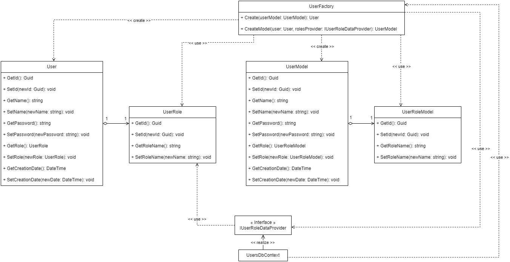  
Код класса UserFactory:  
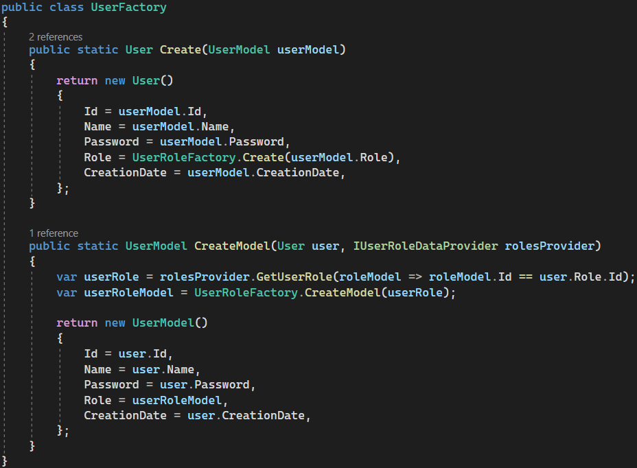  
Пример использования:  
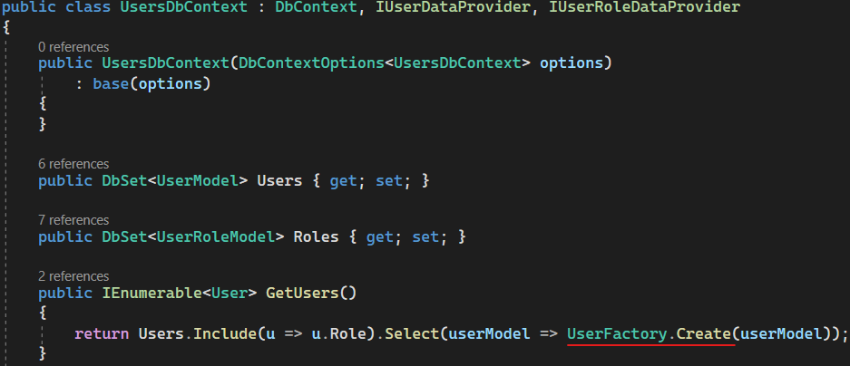

#### 2. Singleton
Реализован класс LoggerToConsole, который реализует интерфейс ILogger, для вывода логов программы на консоль. Нет смысла создавать множество экземпляров данного класса, но необходимо реализовывать интерфейс ILogger (например, чтобы можно было легко подменить его на логгер в файл). Таким образом, создание статического класса не подойдёт, поэтому в нём реализован подход Singleton.  
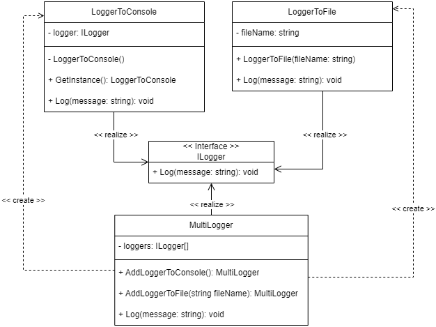  
Код класса LoggerToConsole:  
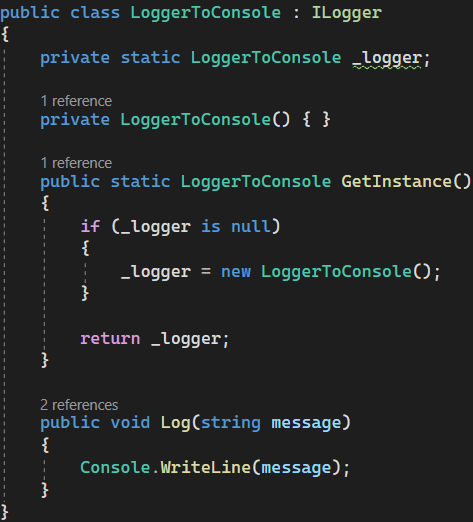

#### 3. Builder
Данный паттерн нужен для того, чтобы конфигурировать какой-либо объект без создания дополнительных наследников и конструктора с большим количеством параметров. Создан класс MultiLogger, который реализует интерфейс ILogger и позволяет выборочно использовать в себе сразу несколько других логгеров (реализованы LoggerToConsole и LoggerToFile). Диаграмма классов представлена в подпункте Singleton. 
Код класса MultiLogger:  
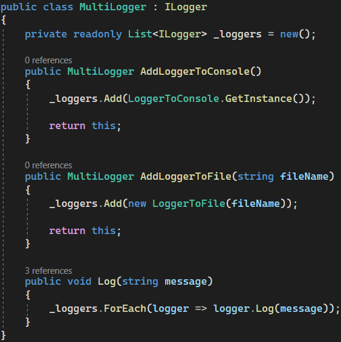 
Пример использования: 
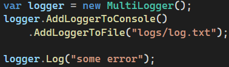 
По необходимости можно без проблем добавить ещё несколько логгеров и выборочно использовать какие-либо из них (например, логирование в консоль использовать только в режиме отладки).

### Структурные шаблоны

#### 1. Composite
Описанный выше класс MultiLogger можно представить в виде Composite, так как он содержит в себе объекты, реализующие интерфейс ILogger, и он сам реализует данный интерфейс.  
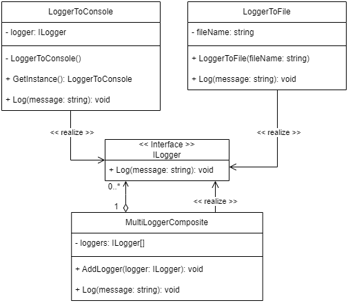 
Код класса MultiLoggerComposite:  
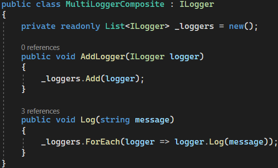  
Пример использования:  
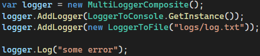

#### 2. Facade
Класс UserFacade реализует данный шаблон в виде выделения частых операций, направленных на конкретный сценарий использования (например, добавить администратора в систему). Если не использовать данный класс, то клиенту придётся вручную создавать роль "Администратор", если такой не существует, и создавать нового пользователя с данной ролью.  
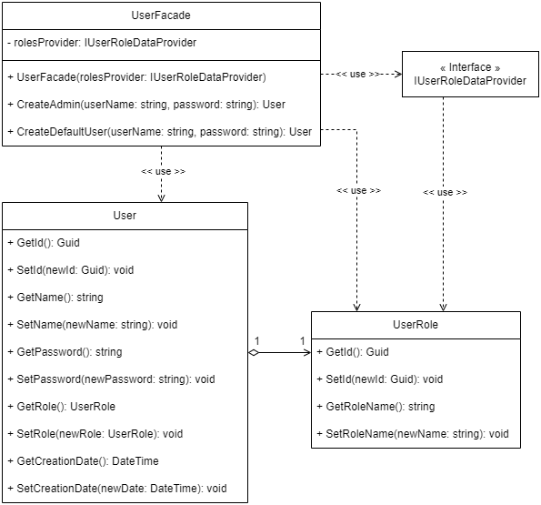  
Код класса UserFacade:  
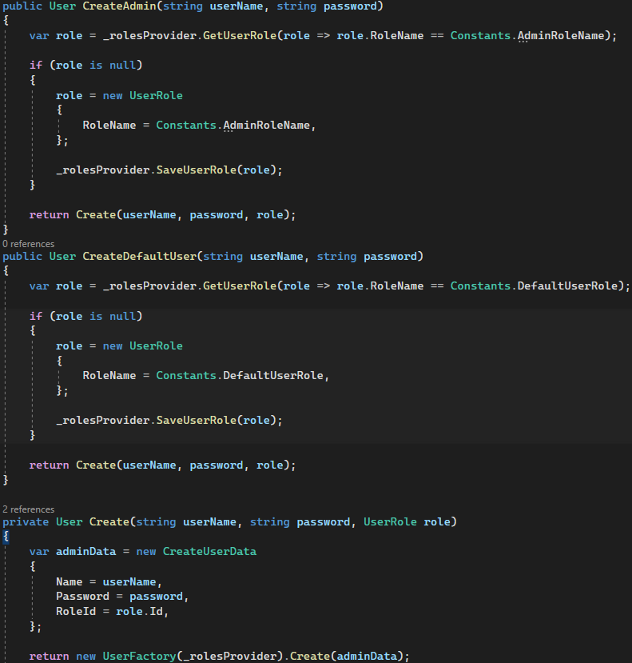

#### 3. Decorator
Класс EncryptUsersDb является дополнительной обёрткой над UsersDbContext для шифрования и дешифровки паролей пользователей (чтобы хранить в бд пароли в зашифрованном виде, а внутри программы использовать их в исходном виде). UsersDbContext реализует интерфейс IUserDataProvider, соответственно, EncryptUsersDb так же должен реализовывать данный интерфейс. Реализованные методы должны вызывать те же методы из UserDbContext с дополнительной обработкой.  
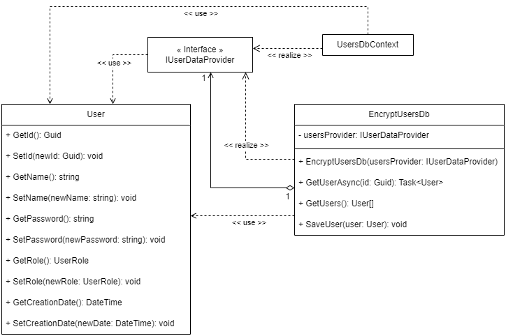  
Код класса EncryptUsersDb:  
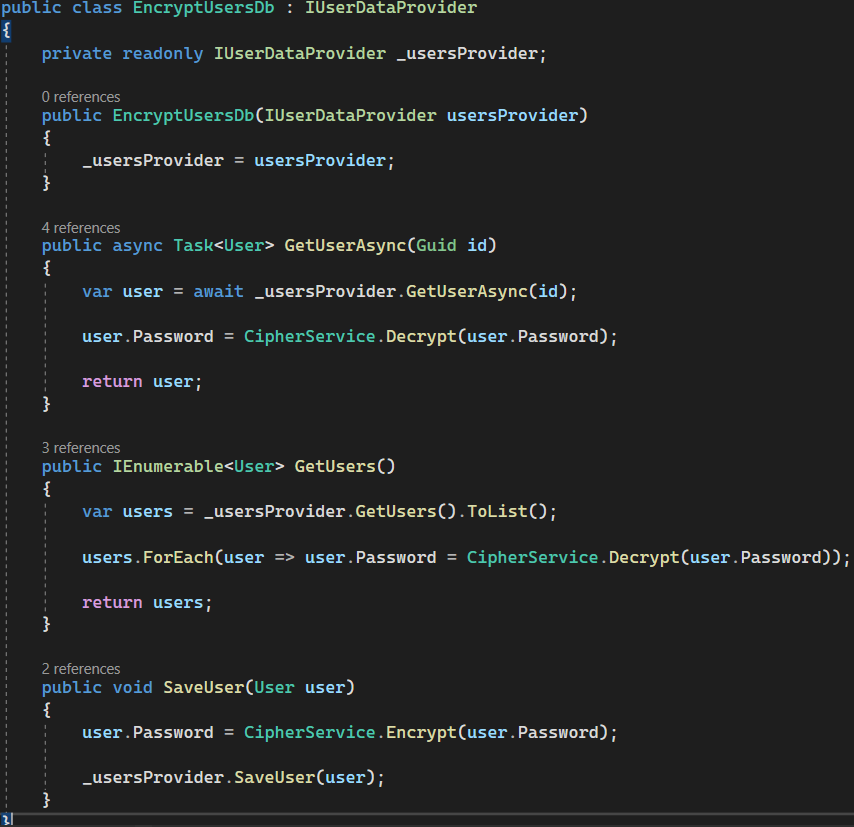  
Соответственно, классам, которые требуют объекты, реализующие интерфейс IUserDataProvider, должны получать EncryptUsersDb, который, в свою очередь, должен получить обычный UsersDbContext.

#### 4. Proxy
Данный патерн очень схож с Decorator и позволяет, например, откладывать какие-либо ресурсоёмкие операции. Класс UsersDbContextProxy кэширует обращения на получения пользователей в системе (чтобы снизить количество обращений к бд). Если пользователь не закеширован, то вызов переадресуется основному классу с доступом к бд (UsersDbContext).  
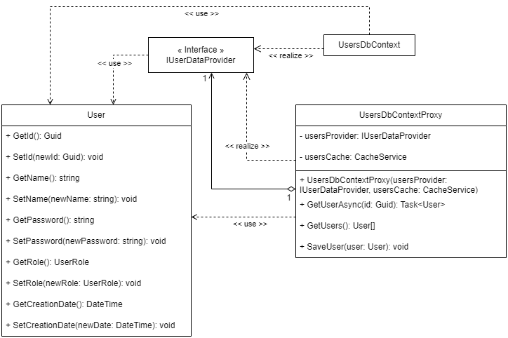  
Код класса UsersDbContextProxy:  
  

### Поведенческие шаблоны

#### 1. Template Method
Шаблонный метод подразумевает создание основного "скелета" для выполнения какой-то задачи. Класс SessionMaker определяет основной метод по созданию сессии для пользователя "CreateSession". Этот метод требует дополнительный параметр - время до истечения сессии в секундах. Но для разных ролей пользователей время до истечения может быть разным, поэтому дочерние классы SessionMaker должны переопределять метод "GetExpirationSeconds".  
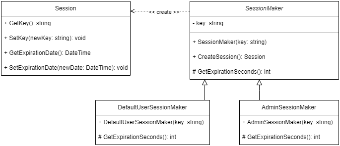  
Код классов, представленных на диаграмме:  
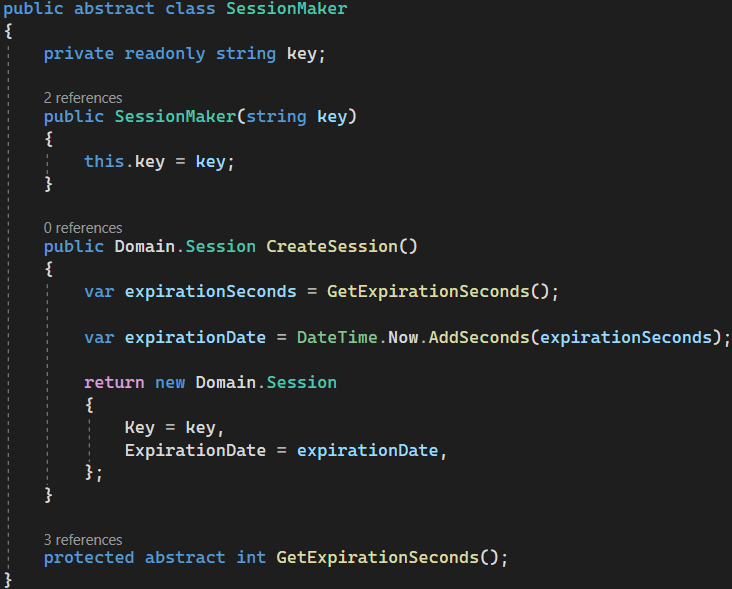  
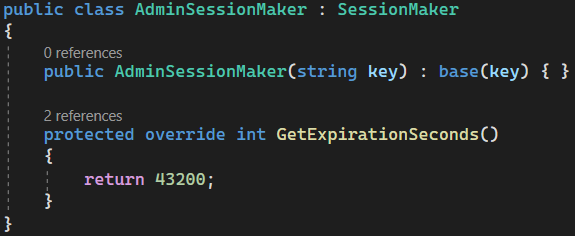  
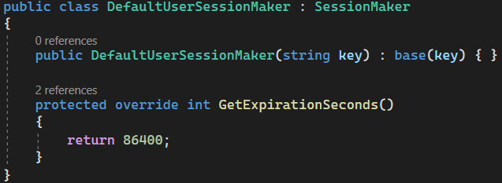  

#### 2. Strategy
Данный шаблон подразумевает делегирование клиенту какой-либо логики для большей вариативности использования метода. Интерфейс IFilter определяет метод Filter, который используется для определения, удовлетворяет ли входной объект какому-либо условию. В системе в базе данных в каких-то случаях нужно найти роль пользователя по её названию, а иногда по id, поэтому в методе поиска можно запросить некоторую "стратегию" поиска, соответствующую интерфейсу IFilter.  
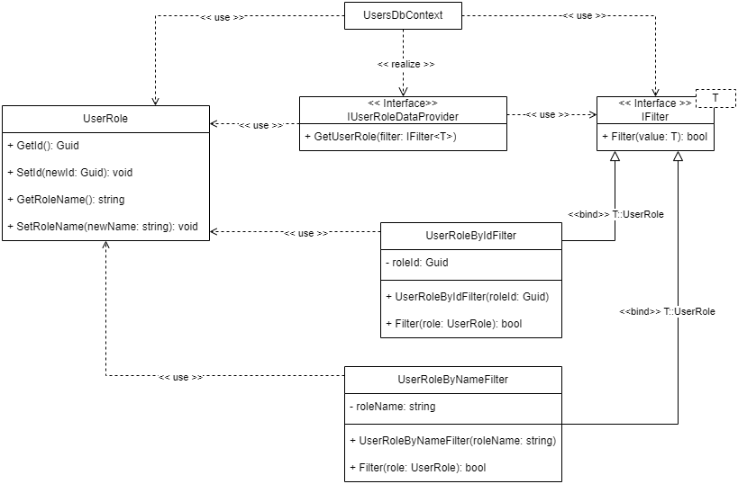  
Код классов, представленных на диаграмме:  
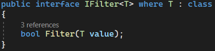  
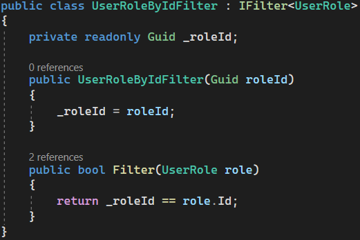  
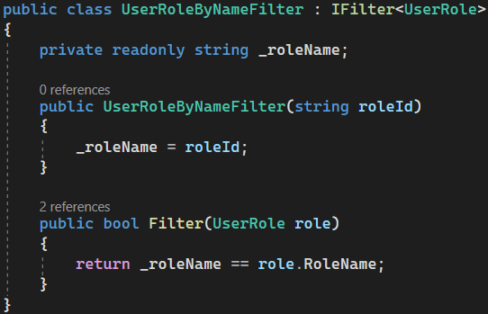  
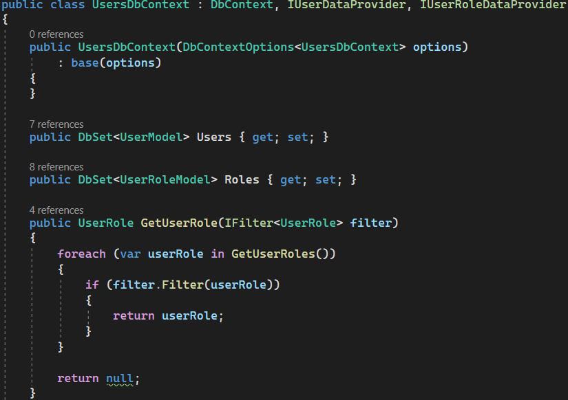

#### 3. Chain of Responsibility
Цепочка обязанностей позволяет динамически добавлять новых обработчиков на какое-то действие, а так же делегировать определённые действия разным объектам с их автоматическим поочерёдным вызовом. Для проверки пароля и никнейма пользователя можно использовать данный подход: для проверки пароля свой обработчик, для никнейма - другой. Интерфейс ICheckHandler определяет функцию Handle, которая возвращает true или false в зависимости от переопределяемого классом условия, и если был возвращён false, то вызов последующих обработчиков автоматически прерывается.  
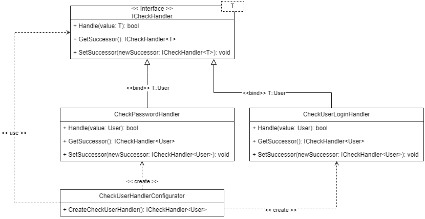  
Код классов, представленных на диаграмме:  
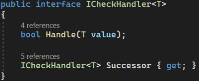  
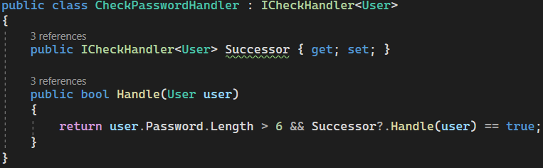  
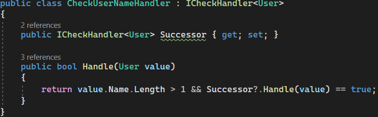  
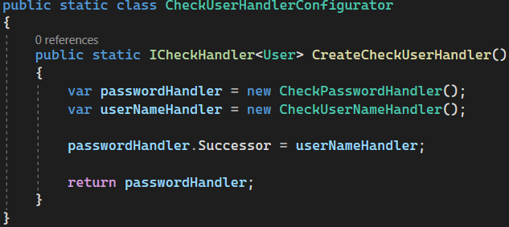  

#### 4. Mediator
Паттерн "Посредник" необходим, чтобы снизить количество связей классов, когда им необходимо общаться между собой. Его можно использовать как некоторый брокер сообщений, когда есть один класс отправитель, а другой - получатель. Класс RequestsMediator получает сообщение в виде некоторого объекта и определяет, каким получателям должен быть отправлен этот объект. В качестве самих объектов-сообщений используются классы CreateUserData и CreateUserRoleData, содержащие минимальный набор данных, по которым можно создать новых пользователей и их роли соответственно. В качестве получателей: CreateUserHandler и CreateUserRoleHandler, реализующие единый интерфейс IRequestHandler.
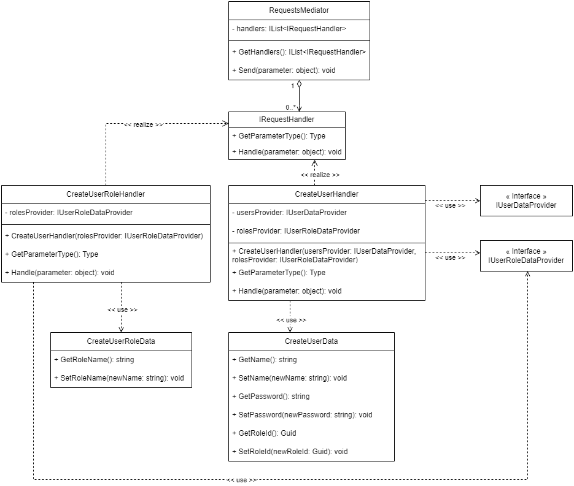  
Код классов, представленных на диаграмме:  
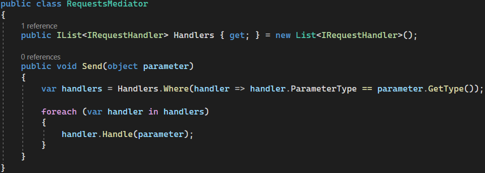  
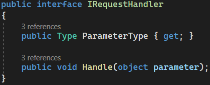  
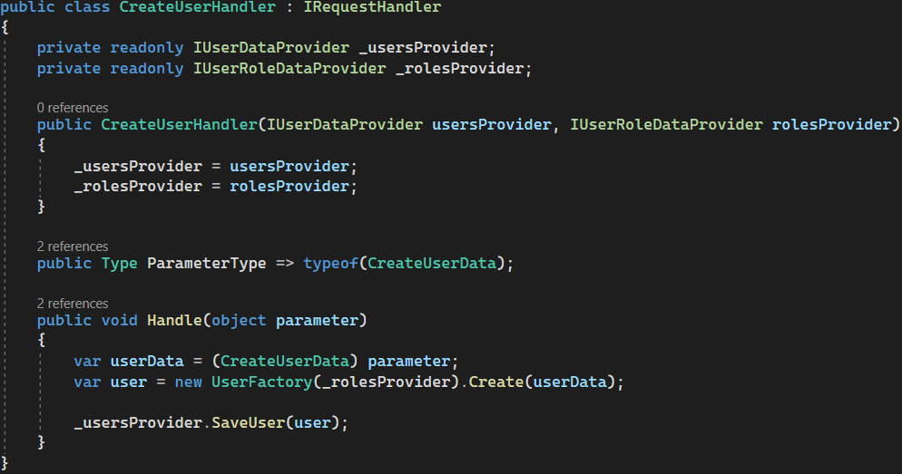  
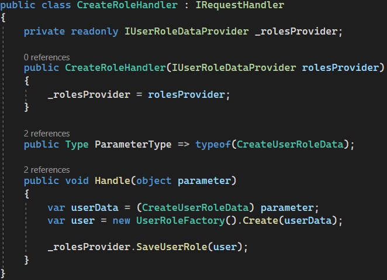  
Пример использования:  
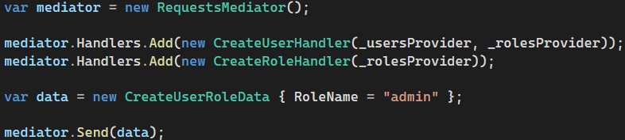  

#### 5. Command
Шаблон "Команда" подразумевает инкапсулирование запроса на изменение состояния системы в виде объектаю. Преимущество такого подхода в том, что мы можем хранить данные объекты после их запуска как некоторую "историю" запуска команд, чтобы потом иметь возможность, например, отменять данные команды.
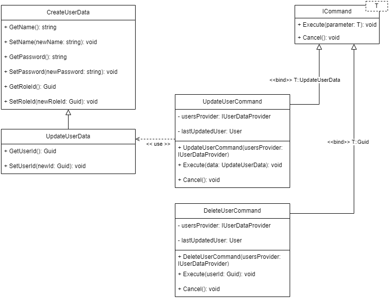  
Код классов, представленных на диаграмме:  
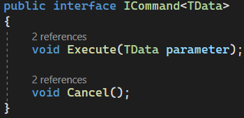  
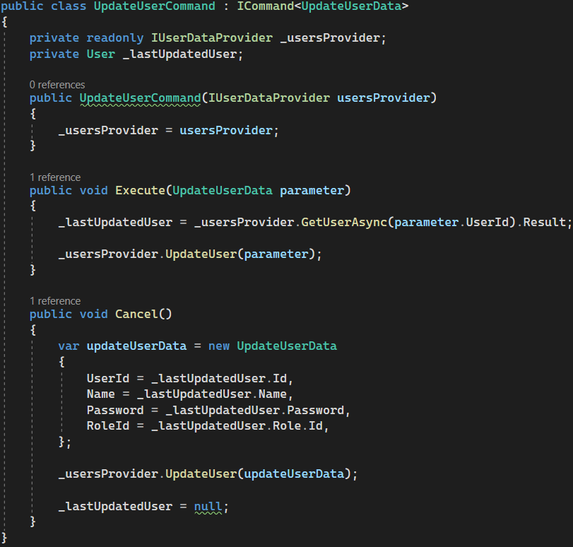  
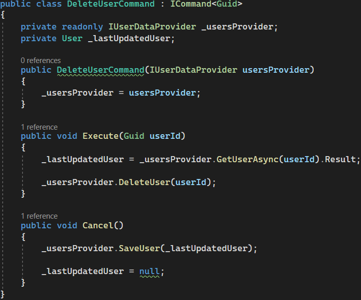  

## Шаблоны проектирования GRASP

### Роли (обязанности) классов

#### 1. Creator
Проблема: Дублирование кода по созданию объекта и подверженность изменениям, связанным с созданием этого объекта.  
Решение: Делегирование логики по созданию сложного объекта конкретному классу.  
Пример кода:  
  
Результаты: Снижается количество изменений в коде при изменении логики создания объекта.  
Связь с другими паттернами: Factory Method, Abstract Factory.

#### 2. Information Expert
Проблема: Написание классов, которые имеют слишком много связей.  
Решение: Классы должны иметь чёткую зону ответственности и отвечать за конкретную сущность.  
Пример кода:  
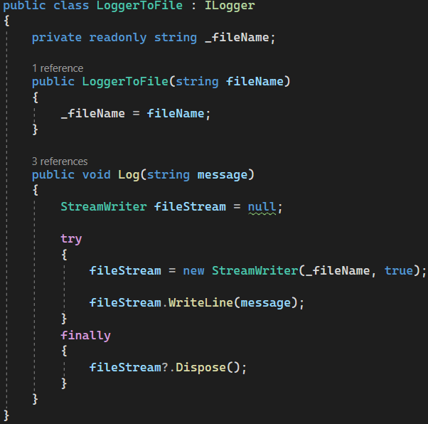  
Данный класс отвечает за запись сообщений в лог-файл и содержит все необходимые данные для выполнения этой операции.  
Результаты: Классы легче модифицировать, так как они не имеют лишних ответственностей и, следовательно, лишних связей.
Связь с другими принципами: Single Responsibility Principle.

#### 3. Indirection
Проблема: Объектам нужен доступ к функционалу других объектов, что приводит к возрастанию их связанности.  
Решение: Создание объектов-посредников.  
Пример кода:  
  
Данный класс отвечает за вызов нужных обработчиков при получении какого-то объекта от другого класса. Классу-отправителю нужно сделать что-то с объектом, но он не знает, как это сделать, поэтому он должен переслать этот объект другому классу. Благодаря классу-посреднику класс-отправитель может ничего не знать о классах-получателях.  
Результаты: Низкая связанность классов и высокое сцепление внутри каждого класса, что даёт нам возможность лёгкой модификации кода.  
Связь с другими паттернами: Mediator.

#### 4. Pure Fabrication
Проблема: Следование принципу "Information Expert" в какой-то момент может привести к большому количеству большому количеству кода в одном классе.  
Решение: Вынести часть логики класса в другой дополнительный объект.  
Пример кода:  
  
Класс UsersDbContext принимает в себя объект, который определяет логику, по которой извлекать данные из базы данных. Конечно, можно было реализовать все возможные сценарии в UsersDbContext, но тогда этот класс сильно увеличился бы, а также добавились бы ненужные зависимости.  
Результаты: Уменьшение зависимостей класса и его размера.  
Связь с другими паттернами: Strategy.

#### 5. Controller
Проблема: Необходимость получения результата через одну точку доступа.  
Решение: Создание единого интерфейса для выполнения какого-либо сценария использования.  
Пример кода:  
  
Класс UserFacade реализует различные сценарии использования по созданию пользователей (с разными ролями), используя дополнительные классы и предоставляя итоговый результат.  
Результаты: Упрощение получения нужного результата, при этом с избавлением от возможного дублирования кода.  
Связь с другими паттернами: Facade, MVC.

### Принципы разработки

#### 1. Low Coupling
Проблема: Зависимость класса от большого количества других классов (в том числе от их конкретных реализаций).  
Решение: Выделение интерфейса для классов, подверженных изменениям.  
Пример кода:  
  
Данному классу необходим доступ к базе данных. Чтобы снизить его зависимость от конкретного объекта с доступом к базе данных, он принимает объект, реализующий все необходимые функции для данного класса.  
Результаты: При изменении реализации одного объекта, зависимый объект не будет нуждаться в изменениях.  
Связь с другими паттернами: Dependency Injection, Dependency Inversion Principle.

#### 2. High Cohesion
Проблема: Сложно поддерживать классы, которые имеют много обязанностей.  
Решение: Разделять классы на более мелкие, у которых будет одна причина для изменения.  
Пример кода:  
  
  
Каждый приведённый класс отвечает только за свою проверку объекта "User".  
Результаты: Становится легче поддерживать классы, так как они имеют свою зону ответственности.  
Связь с другими паттернами: Single Responsibility Principle.

#### 3. Protected Variations
Проблема: Изменения в одном объекте вызывают изменения в другом.  
Решение: Выделение интерфейса для классов, подверженных изменениям.  
Пример кода:  
  
Данному классу необходим доступ к базе данных. Конкретная реализация по получению доступа к базе данных может измениться, поэтому данный класс принимает объект, реализующий все необходимые функции для доступа к БД.  
Результаты: При изменении реализации одного объекта, зависимый объект не будет нуждаться в изменениях.  
Связь с другими паттернами: Dependency Injection, Dependency Inversion Principle.

### Свойство программы (цель)

#### Polymorphism
Проблема: Много дублирования кода.  
Решение: Унаследовать классы с повторяющимся кодом от класса, который будет содержать данный код.  
Пример кода:  
  
  
  
Результаты: Классы-наследники дополняют реализацию базового класса, что исключает дублирование кода.
Связь с другими паттернами: Template Method, Abstract Factory.